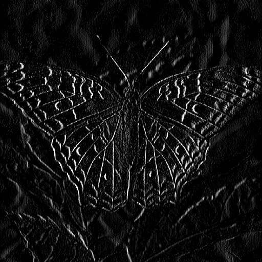
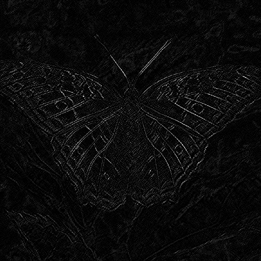
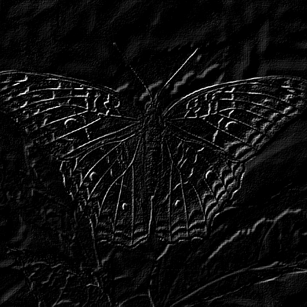

# Image Processing (MC920) - Convolution Filters

- [Requirements](papers/enunciado.pdf)
- [Report](papers/entrega.pdf)

This project is a simple sandbox for spatial convolution. A tiny CLI takes a grayscale PNG, applies one or more preset kernels, and shows or saves the output. The available catalogue spans eleven classic kernels:

- Gaussian and box blurs
- two Laplacian edge detectors
- Sobel $x$, $y$, and $mag$
- Prewitt
- two diagonal line detectors
- a 45° motion blur
- a simple sharpening mask

Below are three representative results on the familiar **butterfly** test image.

